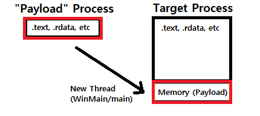
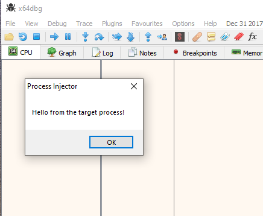

## Injection Technique: Loaded Module Reflection  
Evasion & Injection Technique: Copies the current process module into a target process and begins execution (Windows)  

# What is this?  
This example shows how we can mirror a loaded module (exe or dll) into another running process, which creates 'managed shellcode' with no detectable module running inside the target process. The injected module is undetected by most anti-cheat systems and won't show up from DLL walking, thus it can be used for delivery of some payload or patching bytes. The code example has been expanded to show how a working winGUI can be spawned - the GUI can then be used to read/write memory or do other actions. One way to think of this technique could be "managed shellcode injection", as you get to compile your payload module using C/C++ while making use of concepts seen in shellcode injection. After finishing this project I became aware of MITRE technique T1620, which is essentially the same (https://attack.mitre.org/techniques/T1620/).

# Steps Taken:  
1. Open the target process and allocate space greater or equal to the payload's image size using `VirtualAllocEx`  
2. Take the address for our new allocated buffer and write over the NT Optional header's ImageBase member with this address  
3. Copy all bytes from payload image to a buffer, write it into the target process using `WriteProcessMemory` after calling `VirtualProtectEx`  
4. Calculate the offset to our image's `main` routine by subtracting the address of `main` from the payload's image base  
5. Use the `main` offset (added with step 1's address) with `CreateRemoteThread` to make a new thread in our target process and begin program flow  

In summary, this technique allocates some space in the target, writes the current process module bytes to it, finds the 'WinMain' or 'Main' or 'Dllmain' offset, then creates a remote thread at that offset to execute the payload.  

# Notice  
For this technique you will want to call function pointers (address calculated at runtime with GetProcAddress) for any calls outside this module, otherwise crashes will occur. This is because the .dll containing that function might not be loaded in your target process, or is loaded in the target process at some other address. You are 'living off the land' of the target process and must make use of the modules loaded inside the target, otherwise the chance of detection grows if you start loading extra .dlls at runtime to get your own code to work properly. A code example has been added with Windows Forms as a GUI to better display this concept.  

DLL's can also be 'reflected' into a target process in a similar way. Ultimately, any injected code will be seen as shellcode to the target process and thus both processees and .dll modules will work with this technique. 

# Screenshots  
  
  
